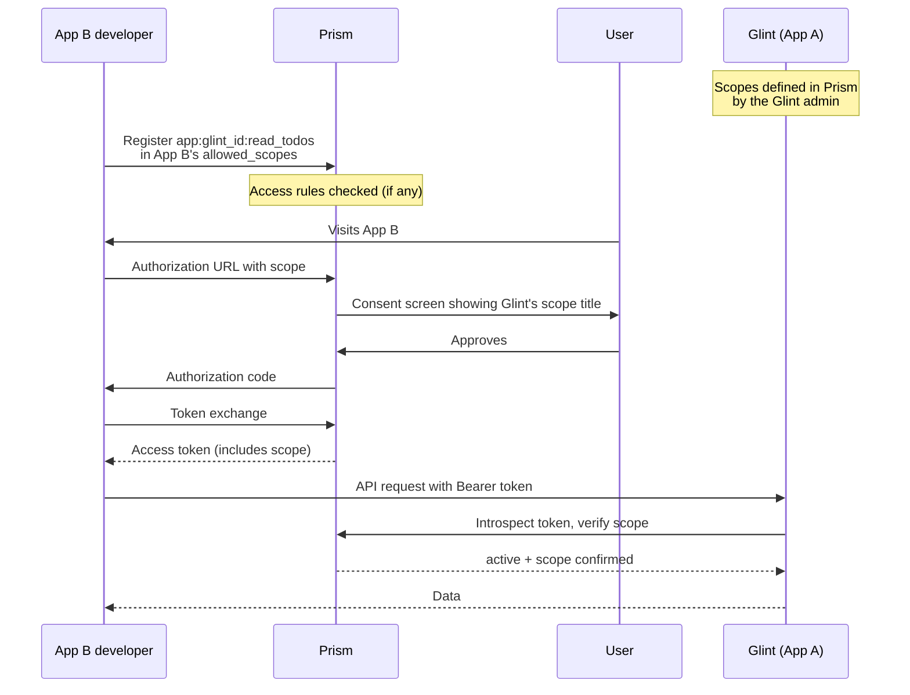

# Cross-App Integration

Glint supports a delegation model where other OAuth applications can access Glint's data on behalf of their users — without any separate "app registration" in Glint itself. The entire authorization chain flows through Prism.

## How It Works

Glint is **App A** (the resource provider). Any other app is **App B** (the consumer). The flow relies on Prism's cross-app scope delegation:

```
app:<glint_client_id>:<inner_scope>
```

For example, if Glint's Prism client ID is `prism_abc123`, a read scope looks like:

```
app:prism_abc123:read_todos
```

### Full Authorization Flow



**Nothing is registered inside Glint.** App B registers Glint's scope inside Prism's own dashboard, and users grant access via Prism's standard consent screen.

---

## Prerequisites

- A running Glint deployment with Prism OAuth configured
- Your Glint deployment's **Prism Client ID** (shown in Settings → App Config)
- Access to the Prism instance that Glint uses, with an App B OAuth client

---

## Step 1 — Define Scopes in Prism (Glint Admin)

A Glint owner must first define the permission scopes that App B can request. This is done directly in Prism's dashboard — not in Glint's UI.

Log in to Prism, open Glint's app settings, go to **Permissions**, and add scope definitions. Only define the scopes your integrations actually need.

### Available Scopes

| Scope key          | Suggested title              | What it allows                                                   |
| ------------------ | ---------------------------- | ---------------------------------------------------------------- |
| `read_todos`       | Read todos & comments        | List sets, view todos, read comments                             |
| `create_todos`     | Create todos                 | Create todos and sub-todos                                       |
| `edit_todos`       | Edit todo titles             | Rename todos (own and others', per role)                         |
| `complete_todos`   | Toggle completion            | Mark todos complete/incomplete (own and others', per role)       |
| `delete_todos`     | Delete todos                 | Delete todos (own and others', per role)                         |
| `manage_sets`      | Manage sets                  | Create, rename, and delete todo sets                             |
| `comment`          | Post comments                | Add comments to todos                                            |
| `delete_comments`  | Delete comments              | Delete comments (own and others', per role)                      |
| `read_settings`    | Read workspace settings      | Read team settings (name, timezone, etc.)                        |
| `manage_settings`  | Manage workspace settings    | Update team settings                                             |
| `write_todos`      | Create & edit todos (legacy) | Legacy catch-all for create, edit, and complete — use specific scopes for new integrations |

**Minimum for a read-only integration:** `read_todos`

**Minimum for a todo-writing integration:** `read_todos`, `create_todos`

**Recommended for a full automation integration:** `read_todos`, `create_todos`, `edit_todos`, `complete_todos`, `delete_todos`

### Access Rules

Optionally, set **access rules** to restrict which apps or users can register these scopes:

- `app_allow` — only specific App B `client_id`s may request your scopes
- `owner_allow` — only specific Prism user IDs may add your scopes to their app's `allowed_scopes`

Without any allow rules, all apps are permitted by default.

---

## Step 2 — Register the Scope in App B (App B Developer)

In **App B's** Prism dashboard → Settings → App Permissions, enter Glint's client ID and select the inner scopes your app needs. For example, selecting `read_todos` adds:

```
app:prism_abc123:read_todos
```

to App B's `allowed_scopes`. This step is gated by any `owner_allow` rules Glint's admin may have set.

Alternatively, via API:

```bash
curl -X PATCH https://prism.example.com/api/apps/<appB_id> \
  -H "Authorization: Bearer <your-token>" \
  -H "Content-Type: application/json" \
  -d '{
    "allowed_scopes": [
      "openid", "profile", "teams:read",
      "app:prism_abc123:read_todos",
      "app:prism_abc123:create_todos"
    ]
  }'
```

Request only the scopes your app genuinely needs. Users see the scope titles on the Prism consent screen.

---

## Step 3 — Request the Scope in the Authorization URL

When App B redirects a user to Prism for login, include Glint's scopes in the `scope` parameter:

```
https://prism.example.com/api/oauth/authorize
  ?client_id=<appB_client_id>
  &redirect_uri=https://appb.example.com/callback
  &response_type=code
  &scope=openid+profile+teams%3Aread+app%3Aprism_abc123%3Aread_todos+app%3Aprism_abc123%3Acreate_todos
  &code_challenge=...
  &code_challenge_method=S256
```

The user will see a consent card in Prism showing Glint's scope titles as defined in Step 1.

---

## Step 4 — Exchange the Code and Call Glint

After the user approves and you complete the standard token exchange, use the resulting access token as a `Bearer` token when calling Glint:

```ts
const response = await fetch(
  `https://glint.example.com/api/cross-app/teams/${teamId}/sets`,
  {
    headers: {
      Authorization: `Bearer ${accessToken}`,
    },
  }
);
const { sets } = await response.json();
```

---

## Team Membership Resolution

Glint's cross-app endpoints are team-scoped. To serve a request, Glint must verify that the user (identified by the `sub` in the introspected token) is a member of the requested team.

Glint resolves team membership via two paths, in order:

1. **KV cache** (fast path) — populated whenever the user logs in to Glint directly. If the user has logged in to Glint at least once, their team memberships are cached for 1 hour in KV.
2. **Live Prism fetch** (fallback) — if the bearer token includes `teams:read` scope, Glint calls Prism's `/api/oauth/me/teams` in real time and caches the result.

If neither path succeeds, the request returns `403` with an explanatory message. Always include `teams:read` in App B's requested scopes to ensure this fallback works for users who have never logged in to Glint.

### Recommended Minimum Scope Set

```
openid profile teams:read app:prism_abc123:read_todos
```

---

## Permission Enforcement

Possessing a Prism scope is a necessary but not sufficient condition for most write operations. Glint **also** enforces its own role-based permission system on every request.

For example, a user with the `member` role and a `complete_todos` Prism scope will still receive `403` if the team's `complete_any_todo` permission is disabled for members. The two systems work in tandem:

| Check | Where enforced | Failure response |
| ----- | -------------- | ---------------- |
| Token is active and scoped | Prism introspection | `401` / `403` |
| User is a team member | Glint KV / Prism | `403` |
| User has the Glint permission | Glint D1 (per-set or global) | `403` |

Per-set permission overrides are respected. If a team has restricted `view_todos` for a specific set, cross-app requests to that set will be denied even if the global permission is open.

---

## App Token Warning in Glint UI

When a user logs in to Glint and Glint detects that the underlying access token was issued to an **external application** (i.e., the token's `client_id` differs from Glint's own `client_id`), Glint displays a modal warning:

> **Access via App Token** — This session was established using a token issued to an external application, not directly to you. If you did not expect this, sign out immediately.

The user can choose to continue or sign out. This is a security safeguard and should not appear under normal cross-app usage (where App B uses the token server-side and the user logs in to Glint separately through Glint's own flow).

---

## Error Reference

| Status | Meaning                                                                          |
| ------ | -------------------------------------------------------------------------------- |
| `401`  | Missing or malformed `Authorization` header, or token is inactive/expired        |
| `403`  | Token is missing the required scope                                              |
| `403`  | User is not a member of the team                                                 |
| `403`  | Team membership unavailable (no KV cache and no `teams:read` in token scope)     |
| `403`  | User's Glint role permission is denied for this operation or set                 |
| `404`  | Resource not found, or does not belong to the requested team                     |

---

## Security Notes

- Glint **always** verifies tokens via Prism's introspection endpoint — it never trusts the token payload directly.
- App B's `client_secret` is never involved; only the `client_id` identifies the scope namespace.
- If you want to restrict which apps can use Glint's scopes, set `app_allow` rules in Prism before publishing the `client_id` to integrators.
- Revoking a user's App B consent in Prism also removes their access to Glint's resources — no extra action needed.
- Cross-app tokens respect per-set permission overrides, not just global role permissions.
- Use the most specific scopes available. Requesting `write_todos` gives broader access than `create_todos` alone.

---

## Full Example (TypeScript)

```ts
const GLINT = "https://glint.example.com";

async function listSets(token: string, teamId: string) {
  const res = await fetch(`${GLINT}/api/cross-app/teams/${teamId}/sets`, {
    headers: { Authorization: `Bearer ${token}` },
  });
  if (!res.ok) throw new Error((await res.json()).error);
  return (await res.json()).sets as Array<{ id: string; name: string }>;
}

async function listTodos(token: string, teamId: string, setId: string) {
  const res = await fetch(
    `${GLINT}/api/cross-app/teams/${teamId}/sets/${setId}/todos`,
    { headers: { Authorization: `Bearer ${token}` } },
  );
  if (!res.ok) throw new Error((await res.json()).error);
  return (await res.json()).todos;
}

async function createTodo(
  token: string,
  teamId: string,
  setId: string,
  title: string,
  parentId?: string,
) {
  const res = await fetch(
    `${GLINT}/api/cross-app/teams/${teamId}/sets/${setId}/todos`,
    {
      method: "POST",
      headers: {
        Authorization: `Bearer ${token}`,
        "Content-Type": "application/json",
      },
      body: JSON.stringify({ title, parentId }),
    },
  );
  if (!res.ok) throw new Error((await res.json()).error);
  return (await res.json()).todo;
}

async function completeTodo(token: string, teamId: string, todoId: string) {
  const res = await fetch(
    `${GLINT}/api/cross-app/teams/${teamId}/todos/${todoId}`,
    {
      method: "PATCH",
      headers: {
        Authorization: `Bearer ${token}`,
        "Content-Type": "application/json",
      },
      body: JSON.stringify({ completed: true }),
    },
  );
  if (!res.ok) throw new Error((await res.json()).error);
}

async function postComment(
  token: string,
  teamId: string,
  todoId: string,
  body: string,
) {
  const res = await fetch(
    `${GLINT}/api/cross-app/teams/${teamId}/todos/${todoId}/comments`,
    {
      method: "POST",
      headers: {
        Authorization: `Bearer ${token}`,
        "Content-Type": "application/json",
      },
      body: JSON.stringify({ body }),
    },
  );
  if (!res.ok) throw new Error((await res.json()).error);
  return (await res.json()).comment;
}

async function getSettings(token: string, teamId: string) {
  const res = await fetch(
    `${GLINT}/api/cross-app/teams/${teamId}/settings`,
    { headers: { Authorization: `Bearer ${token}` } },
  );
  if (!res.ok) throw new Error((await res.json()).error);
  return (await res.json()).settings;
}
```
