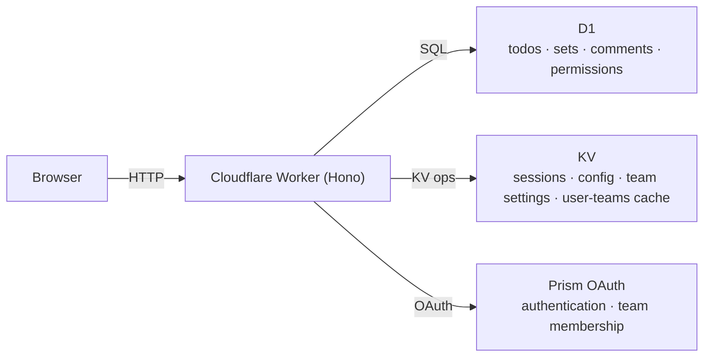

# Getting Started

Glint is a team-based todo list application built on Cloudflare Workers. It uses D1 for persistent storage, KV for sessions and configuration, and Prism as the OAuth identity provider. The entire stack runs at the edge — no separate backend servers or databases to manage.

## Architecture Overview



The worker serves both the static frontend assets and the REST API from the same origin. This means no CORS configuration is required between the frontend and backend.

---

## Prerequisites

- **[Bun](https://bun.sh)** ≥ 1.0 — package manager and build tool
- **[Wrangler CLI](https://developers.cloudflare.com/workers/wrangler/)** — Cloudflare Workers deployment tool
- A running **[Prism](https://github.com/siiway/prism)** instance for authentication

> Glint does not support other identity providers. Prism is required.

---

## Installation

```bash
git clone https://github.com/siiway/glint.git
cd glint
bun install
```

---

## Cloudflare Resource Setup

### 1. Create a D1 database

```bash
wrangler d1 create glint-db
```

The output includes a `database_id`. Copy it into `wrangler.jsonc`:

```jsonc
{
  "d1_databases": [
    {
      "binding": "DB",
      "database_name": "glint-db",
      "database_id": "YOUR_DATABASE_ID_HERE"
    }
  ]
}
```

### 2. Create a KV namespace

```bash
wrangler kv namespace create KV
```

Copy the `id` into `wrangler.jsonc`:

```jsonc
{
  "kv_namespaces": [
    {
      "binding": "KV",
      "id": "YOUR_KV_NAMESPACE_ID_HERE"
    }
  ]
}
```

For local development, also add a `preview_id` (create one with `wrangler kv namespace create KV --preview`).

### 3. Apply database migrations

Glint's schema is managed via numbered migration files in `migrations/`.

```bash
# Local development
wrangler d1 migrations apply glint-db --local

# Production
wrangler d1 migrations apply glint-db
```

Migrations are applied in order and are idempotent — running them again is safe.

### 4. Register a Prism OAuth app

In your Prism instance, create a new OAuth application with the following settings:

| Field            | Value                                                              |
| ---------------- | ------------------------------------------------------------------ |
| Redirect URI     | `http://localhost:5173/callback` (dev) or `https://your.domain/callback` (prod) |
| Scopes           | `openid profile email teams:read`                                  |
| Client type      | Public (PKCE) **or** Confidential (client secret)                  |

Note down the **Client ID**. If using a confidential client, also note the **Client Secret**. You will enter these in the initialization wizard on first visit.

#### PKCE vs Confidential Client

| Mode          | How it works                                                         | When to use                          |
| ------------- | -------------------------------------------------------------------- | ------------------------------------ |
| PKCE          | Frontend generates a random verifier; server verifies via challenge  | Public deployments, SPAs             |
| Confidential  | Server sends `client_secret` during code exchange; never in browser  | Private deployments, added security  |

---

## Development

Start the local development server:

```bash
bun run dev
```

This runs both the Vite dev server (frontend, port 5173) and the Wrangler local worker simultaneously.

On first visit to `http://localhost:5173`, Glint shows the **initialization wizard**:

1. **Configure Prism** — Enter the base URL, Client ID, redirect URI, and optionally the client secret.
2. **Access control** — Optionally enter an allowed team ID to restrict which Prism team members can sign in.
3. **Initialize** — Creates all database tables and saves configuration to KV.

Configuration is stored entirely in KV — no environment variables or files need to be edited after setup.

### Local KV Persistence

Wrangler's local KV is stored in `.wrangler/state/v3/kv/`. If you need to reset the local state (for example, to re-run the init wizard), delete the relevant files or run:

```bash
wrangler kv key delete --local --binding KV "init:configured"
```

---

## Deployment

Build and deploy to Cloudflare:

```bash
bun run deploy
```

This runs `bun run build` (compiles the frontend into `dist/`) and then `wrangler deploy` (uploads the worker and assets).

After deploying, visit your domain. If the worker is freshly deployed and KV is empty, the init wizard will appear again.

### Environment Variable: `ALLOWED_TEAM_ID`

You can restrict access to a specific Prism team by setting the `ALLOWED_TEAM_ID` environment variable in `wrangler.jsonc` or in the Cloudflare dashboard. This overrides the KV-stored value and cannot be changed from within the app UI:

```jsonc
{
  "vars": {
    "ALLOWED_TEAM_ID": "your-prism-team-id"
  }
}
```

When set via environment variable, the Settings → App Config page shows a note indicating the value is locked.

---

## Troubleshooting

### "Session expired" appears immediately after login

Check that the `redirectUri` in your Prism app exactly matches the one configured in Glint's init wizard, including the protocol and trailing path. A mismatch causes the code exchange to fail.

### Init wizard reappears after deployment

The init state (`init:configured`) is stored in KV. If you created a new KV namespace or cleared it, the wizard will re-run. Re-initializing is safe — it re-creates tables (using `CREATE TABLE IF NOT EXISTS`) and overwrites config.

### Users from the wrong team can sign in

Double-check the `allowed_team_id` in Settings → App Config, or set `ALLOWED_TEAM_ID` as an environment variable for stricter enforcement. Team membership is evaluated at login time; changing the setting takes effect on next login.

### Avatar images not loading

Avatars are fetched directly from Prism's CDN by the browser. If Prism is on a private network, avatars may not be accessible from users' browsers. There is no avatar proxy in Glint — avatars must be publicly reachable.
