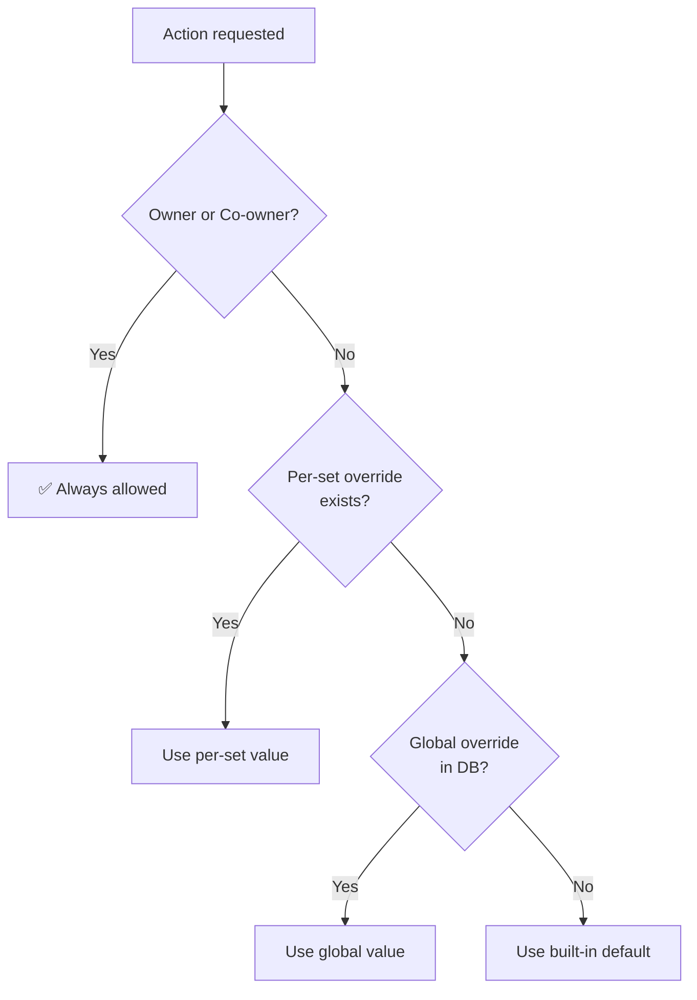

# Permissions

Glint has a granular, configurable permission system. The team owner can control exactly what admins and members are allowed to do, down to the level of individual todo sets.

---

## How It Works

- **Owner** and **Co-owner** always have full access. This is hardcoded and unaffected by any permission configuration.
- **Admin** and **Member** roles have configurable permissions with sensible built-in defaults.
- Permissions can be set at two levels:
  - **Global** (team-wide) — applies to all todo sets
  - **Per-set** (override for a specific set) — takes priority over global for that set only

When an action is requested, the system evaluates permissions in the following order:



The first matching rule wins. Per-set overrides give you surgical control: tighten one set while keeping defaults everywhere else, or open up a specific set for members while keeping the team locked down globally.

---

## Resolution Order

| Priority | Source | Scope |
| -------- | ------ | ----- |
| 1 (highest) | Hardcoded | Owner / Co-owner: always allowed |
| 2 | Per-set override (D1) | Only for the specific set being accessed |
| 3 | Global override (D1) | All sets, unless overridden at per-set level |
| 4 (lowest) | Built-in defaults | Fallback if no overrides are stored |

---

## Permission Keys

| Key | Default: Admin | Default: Member | Description |
| --- | :---: | :---: | --- |
| `manage_settings` | No | No | Edit site name, logo, branding, and app config |
| `manage_permissions` | No | No | Edit permission rules (owner-only to grant) |
| `manage_sets` | Yes | No | Create, rename, delete, and reorder todo sets |
| `create_todos` | Yes | Yes | Create new todos |
| `edit_own_todos` | Yes | Yes | Edit todos the user created |
| `edit_any_todo` | Yes | No | Edit todos created by others |
| `delete_own_todos` | Yes | Yes | Delete todos the user created |
| `delete_any_todo` | Yes | No | Delete todos created by others |
| `complete_any_todo` | Yes | No | Toggle completion on others' todos |
| `add_subtodos` | Yes | Yes | Create nested sub-todos |
| `reorder_todos` | Yes | No | Drag to reorder todos |
| `comment` | Yes | Yes | Add comments to todos |
| `delete_own_comments` | Yes | Yes | Delete comments the user posted |
| `delete_any_comment` | Yes | No | Delete comments posted by others |
| `view_todos` | Yes | Yes | View todos in a set |

---

## Managing Permissions

1. Go to **Settings → Permissions** (requires the `manage_permissions` permission or owner role).
2. Select a **scope** from the dropdown:
   - **Global** — changes apply to all sets (unless a set has its own override)
   - **Specific set** — changes apply only to that set
3. Toggle switches for each permission per role (Admin / Member).
4. Click **Save Permissions**.

Use **Reset to Defaults** to remove all custom overrides for the selected scope, reverting to built-in defaults (or, for per-set, back to global).

---

## Per-Set Override Examples

### Restricting a sensitive set

You have a set called "HR Only" that members should not see, but globally `view_todos` is allowed for members:

| Scope | Role | `view_todos` |
| ----- | ---- | :---: |
| Global | Member | ✓ |
| "HR Only" set | Member | ✗ |

Members can see all other sets but will receive an "Unauthorized" message when navigating to "HR Only", and will be redirected to the home page.

### Opening a public set for members to manage

You want members to be able to reorder todos in a specific "Backlog" set, but not elsewhere:

| Scope | Role | `reorder_todos` |
| ----- | ---- | :---: |
| Global | Member | ✗ |
| "Backlog" set | Member | ✓ |

Members can drag-reorder in "Backlog" but nowhere else.

---

## Important Constraints

::: warning
Only the **owner** can grant the `manage_permissions` permission to admins. This prevents privilege escalation — an admin cannot self-authorize beyond what the owner explicitly allows.
:::

::: tip
Revoking `view_todos` hides a set's contents from that role. Users who navigate directly to the set URL will see an "Unauthorized" notice and be redirected home.
:::

::: info
Owner and Co-owner permissions cannot be restricted by any permission rule. Even if `manage_settings` is globally set to `false` for admins, an owner is never affected.
:::

---

## Checking Effective Permissions

To see the resolved permission matrix for the current user (accounting for role, global overrides, and per-set overrides):

```
GET /api/teams/:teamId/permissions/me?setId=<set-uuid>
```

This returns the effective `true`/`false` value for every permission key, which is exactly what the frontend uses to show or hide UI elements. See [Permissions API](../api/permissions) for the full reference.
