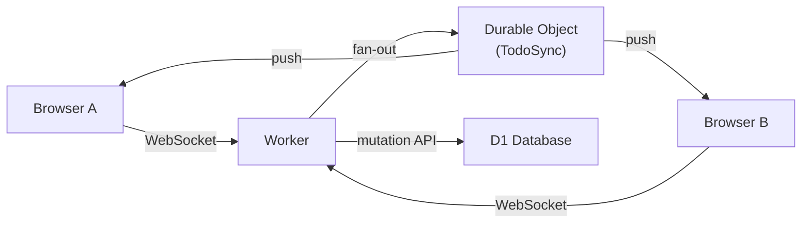

# Realtime Sync

Glint uses WebSockets to push todo changes to all connected users instantly. When one user creates, edits, completes, reorders, or claims a todo, every other user viewing the same set sees the update without refreshing.

---

## How It Works



Each team gets its own **`TodoSync` Durable Object** instance, named after the team ID. When a browser opens a todo set, it opens a WebSocket connection to `/api/teams/:teamId/sets/:setId/ws`. The worker authenticates the request and forwards the upgrade to the Durable Object, tagging the socket with the set ID.

When a mutation completes (create, update, delete, reorder, claim), the worker fires an asynchronous broadcast to the same Durable Object. The DO looks up all sockets tagged with that set ID and sends the event JSON to each one. The broadcast is fire-and-forget — it does not block the mutation response.

---

## Event Types

| Event | Payload |
| --- | --- |
| `todo:created` | Full todo object |
| `todo:updated` | `{ id, ...changed fields }` — partial |
| `todo:deleted` | `{ id }` |
| `todo:reordered` | `{ items: [{ id, sortOrder }] }` |
| `todo:claimed` | `{ id, claimedBy, claimedByName, claimedByAvatar }` |

All events include `setId` so the client can ignore events from other sets if the connection is unexpectedly scoped too broadly.

---

## Client Behavior

The `useWebSocket` hook manages the connection lifecycle:

- Opens a connection when a set is selected and the user is authenticated.
- **Reconnects automatically** on close, using exponential backoff: 500 ms → 1 s → 2 s → … → 30 s cap.
- All incoming events are applied **idempotently** to local state — `todo:created` checks for duplicates before appending, so the user's own actions (which also update local state optimistically) do not appear twice.
- Closes cleanly when the component unmounts or the selected set changes.

---

## Setup

No extra Cloudflare resources need to be created manually. The Durable Object class (`TodoSync`) is declared in `wrangler.jsonc` alongside a migration tag:

```jsonc
{
  "durable_objects": {
    "bindings": [
      { "name": "TODO_SYNC", "class_name": "TodoSync" }
    ]
  },
  "migrations": [
    { "tag": "v1", "new_classes": ["TodoSync"] }
  ]
}
```

Cloudflare provisions the Durable Object namespace automatically on the first `wrangler deploy`. Local development (`bun run dev`) also works — Wrangler simulates Durable Objects in-process with no additional configuration.

::: tip
Durable Objects require a Workers **Paid plan** or higher. The free tier does not support Durable Objects. If you are evaluating Glint on the free tier, realtime sync will fail silently — todo operations still work via normal HTTP; only the live push is unavailable.
:::

---

## WebSocket Endpoint

```
GET /api/teams/:teamId/sets/:setId/ws
Upgrade: websocket
```

Requires an active session (same cookie used by all other API routes). Returns `403` if the user is not a member of the team. Returns `426` if the request is not a WebSocket upgrade.

The endpoint is handled by `worker/routes/ws.ts` and proxied into the `TodoSync` Durable Object at `worker/durable-objects/todo-sync.ts`.
