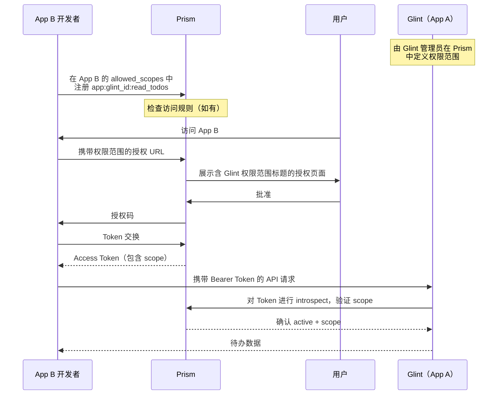

# 跨应用集成

Glint 支持委托授权模型：其他 OAuth 应用可以代表其用户访问 Glint 的数据，无需在 Glint 内部单独注册应用。整个授权链完全通过 Prism 完成。

## 工作原理

Glint 是 **App A**（资源提供方）。其他任何应用是 **App B**（消费方）。该流程依赖 Prism 的跨应用权限范围委托机制：

```
app:<glint_client_id>:<inner_scope>
```

例如，若 Glint 的 Prism Client ID 为 `prism_abc123`，则读取权限范围如下：

```
app:prism_abc123:read_todos
```

### 完整授权流程



**Glint 内部无需注册任何内容。** App B 在 Prism 自己的控制台中注册 Glint 的 scope，用户通过 Prism 的标准授权页面授予访问权限。

---

## 前置条件

- 一个已完成 Prism OAuth 配置的 Glint 实例
- Glint 的 **Prism Client ID**（可在"设置 → 应用配置"中查看）
- 可访问 Glint 所使用的 Prism 实例，并拥有一个 App B OAuth 客户端

---

## 第一步 — 在 Prism 中定义权限范围（Glint 管理员操作）

Glint 的所有者必须首先在 Prism 的控制台中定义 App B 可以申请的权限范围，**无需在 Glint 的 UI 中操作**。

登录 Prism，打开 Glint 的应用设置，进入 **Permissions（权限）** 选项卡，添加如下权限范围定义：

| Scope 键名         | 建议标题             | 说明                                               |
| ------------------ | -------------------- | -------------------------------------------------- |
| `read_todos`       | 读取待办与评论       | 列出分组、查看待办、读取评论                       |
| `create_todos`     | 创建待办             | 新建待办与子待办                                   |
| `edit_todos`       | 编辑待办             | 修改待办标题                                       |
| `complete_todos`   | 切换完成状态         | 标记待办完成或未完成                               |
| `delete_todos`     | 删除待办             | 删除待办                                           |
| `manage_sets`      | 管理分组             | 新建、重命名、删除待办分组                         |
| `comment`          | 发布评论             | 在待办下添加评论                                   |
| `delete_comments`  | 删除评论             | 删除自己或他人的评论（视团队权限）                 |
| `read_settings`    | 读取团队设置         | 读取团队品牌与偏好                                 |
| `manage_settings`  | 管理团队设置         | 修改团队品牌与偏好                                 |
| `write_todos`      | 创建/编辑待办（旧版）| 旧版兼容范围，覆盖创建、编辑、完成；新接入请使用细分 scope |

只需定义你实际需要的 scope。

### 一键导入到 Prism

不想逐条手动添加？将下面的 JSON 直接粘贴到 Prism 的 **Import** 对话框（Glint 应用 → Permissions → Import）即可。同名 scope 会被覆盖更新。

```json
[
  {
    "scope": "read_todos",
    "title": "读取待办与评论",
    "description": "列出分组、查看待办、读取评论。"
  },
  {
    "scope": "create_todos",
    "title": "创建待办",
    "description": "新建待办与子待办。"
  },
  {
    "scope": "edit_todos",
    "title": "编辑待办",
    "description": "修改待办标题。"
  },
  {
    "scope": "complete_todos",
    "title": "切换完成状态",
    "description": "标记待办完成或未完成。"
  },
  {
    "scope": "delete_todos",
    "title": "删除待办",
    "description": "删除待办。"
  },
  {
    "scope": "write_todos",
    "title": "创建/编辑待办（旧版）",
    "description": "旧版兼容范围，覆盖创建、编辑与完成。新接入请使用细分 scope。"
  },
  {
    "scope": "manage_sets",
    "title": "管理分组",
    "description": "新建、重命名、删除待办分组。"
  },
  {
    "scope": "comment",
    "title": "发布评论",
    "description": "在待办下添加评论。"
  },
  {
    "scope": "delete_comments",
    "title": "删除评论",
    "description": "删除自己的评论；具备团队权限时可删除他人评论。"
  },
  {
    "scope": "read_settings",
    "title": "读取团队设置",
    "description": "读取团队品牌与偏好。"
  },
  {
    "scope": "manage_settings",
    "title": "管理团队设置",
    "description": "修改团队品牌与偏好。"
  }
]
```

::: tip 一键替代方案
如果 Glint 应用已经配置了 client secret，并在 Prism 中启用了 `allow_self_manage_exported_permissions`，Glint 所有者可以直接在 Glint 内点击 **设置 → 应用配置 → 注册权限** 把上述定义推送到 Prism。
:::

可选地，可以设置**访问规则**来限制哪些应用或用户可以注册这些 scope：

- `app_allow` — 仅允许特定 App B 的 `client_id` 申请你的 scope
- `owner_allow` — 仅允许特定 Prism 用户 ID 将你的 scope 添加到其应用的 `allowed_scopes`

若未设置任何 allow 规则，则默认所有应用均可使用。

---

## 第二步 — 在 App B 中注册 Scope（App B 开发者操作）

在 **App B** 的 Prism 控制台 → 设置 → 应用权限中，输入 Glint 的 Client ID 并选择 inner scope（如 `read_todos`）。这会将以下内容添加到 App B 的 `allowed_scopes`：

```
app:prism_abc123:read_todos
```

### 一键生成 App B 的允许 scope

填入你的 Glint Client ID，勾选 App B 真正需要的权限，然后点 **复制**，粘贴到 Prism 的 **Import scopes** 对话框（App B → 设置 → Allowed Scopes → Import scopes）即可。已存在的 scope 会保留，新 scope 会被合并进去。**导入后请记得点击保存。**

<ScopeBuilder />

只勾选你真正需要的 scope，其他留空即可。用户会在 Prism 授权页看到这些 scope 的标题。

也可通过 API 完成：

```bash
curl -X PATCH https://prism.example.com/api/apps/<appB_id> \
  -H "Authorization: Bearer <your-token>" \
  -H "Content-Type: application/json" \
  -d '{
    "allowed_scopes": [
      "openid", "profile",
      "app:prism_abc123:read_todos"
    ]
  }'
```

---

## 第三步 — 在授权 URL 中请求 Scope

App B 将用户重定向至 Prism 登录时，需在 `scope` 参数中包含 Glint 的 scope：

```
https://prism.example.com/api/oauth/authorize
  ?client_id=<appB_client_id>
  &redirect_uri=https://appb.example.com/callback
  &response_type=code
  &scope=openid+profile+app%3Aprism_abc123%3Aread_todos
  &code_challenge=...
  &code_challenge_method=S256
```

用户会在 Prism 的授权页面看到一张权限卡片，展示第一步中定义的 Glint scope 标题和说明。

---

## 第四步 — 交换授权码并调用 Glint

用户批准后，完成标准的 Token 交换流程，获得的 access token 的 `scope` 字段将包含 `app:prism_abc123:read_todos`。

调用 Glint 时以 `Bearer` Token 的形式传入：

```ts
const response = await fetch(
  `https://glint.example.com/api/cross-app/teams/${teamId}/sets`,
  {
    headers: {
      Authorization: `Bearer ${accessToken}`,
    },
  }
);
const { sets } = await response.json();
```

---

## 团队成员关系解析

Glint 的跨应用接口以团队为作用域。为处理请求，Glint 需要验证用户（通过 introspect Token 的 `sub` 字段识别）是否为所请求团队的成员。

Glint 按以下顺序解析团队成员关系：

1. **KV 缓存**（快速路径）—— 当用户直接登录 Glint 时自动写入，有效期 1 小时。若用户曾登录过 Glint，则优先使用此缓存。
2. **实时 Prism 请求**（兜底路径）—— 若 Bearer Token 包含 `teams:read` scope，Glint 会实时调用 Prism 的 `/api/oauth/me/teams` 并将结果缓存。

若两种方式均失败，请求将返回 `403` 并附带说明信息。

### App B 推荐的 Scope 组合

```
openid profile teams:read app:prism_abc123:read_todos
```

---

## Glint 界面中的应用令牌警告

当用户登录 Glint 时，若 Glint 检测到当前 access token 是由**外部应用**颁发的（即 token 的 `client_id` 与 Glint 自身的 `client_id` 不符），Glint 将显示一个模态警告：

> **通过应用令牌访问** —— 本次会话使用的是由外部应用颁发的令牌，而非直接为您颁发。如果您未预期此情况，请立即退出登录。

用户可选择继续或退出。这是一项安全保护措施，在正常的跨应用使用场景下（App B 在服务端使用令牌，用户通过 Glint 自身的流程单独登录）不会出现此警告。

---

## 可用 Scope

| Scope 键名     | 允许的操作                                        |
| -------------- | ------------------------------------------------- |
| `read_todos`   | 列出待办分组；列出任意已加入团队中的待办事项      |
| `write_todos`  | 创建待办事项；更新待办标题和完成状态              |
| `delete_todos` | 删除待办事项                                      |

所有操作仍受 Glint 的团队权限规则约束。若用户的团队角色缺少某项权限（如 `create_todos`），即使拥有有效的 `write_todos` scope，API 也会返回 `403`。

---

## 错误参考

| 状态码 | 含义                                                                              |
| ------ | --------------------------------------------------------------------------------- |
| `401`  | 缺少或格式错误的 `Authorization` 头，或 Token 已失效/过期                        |
| `403`  | Token 缺少所需 scope；或用户不是该团队成员                                        |
| `403`  | 无法获取团队成员关系——请在 scope 中包含 `teams:read`，或让用户先登录 Glint 一次  |
| `404`  | 待办分组或待办事项不存在，或不属于所请求的团队                                    |

---

## 安全说明

- Glint **始终**通过 Prism 的 introspect 接口验证 Token，从不直接信任 Token 的载荷内容。
- App B 的 `client_secret` 不参与此流程；仅 `client_id` 用于标识 scope 命名空间。
- 若要限制哪些应用可以使用 Glint 的 scope，请在向外公开 `client_id` 前在 Prism 中设置 `app_allow` 规则。
- 在 Prism 中撤销用户对 App B 的授权，同样会移除其对 Glint 资源的访问权限，无需额外操作。

---

## 完整示例（TypeScript）

```ts
async function getGlintSets(
  accessToken: string,
  glintBaseUrl: string,
  teamId: string,
) {
  const res = await fetch(
    `${glintBaseUrl}/api/cross-app/teams/${teamId}/sets`,
    { headers: { Authorization: `Bearer ${accessToken}` } },
  );

  if (res.status === 401) throw new Error("Token 无效或缺失");
  if (res.status === 403) {
    const { error } = await res.json();
    throw new Error(`权限不足: ${error}`);
  }
  if (!res.ok) throw new Error(`HTTP ${res.status}`);

  const { sets } = await res.json();
  return sets as Array<{ id: string; name: string }>;
}

async function createGlintTodo(
  accessToken: string,
  glintBaseUrl: string,
  teamId: string,
  setId: string,
  title: string,
) {
  const res = await fetch(
    `${glintBaseUrl}/api/cross-app/teams/${teamId}/sets/${setId}/todos`,
    {
      method: "POST",
      headers: {
        Authorization: `Bearer ${accessToken}`,
        "Content-Type": "application/json",
      },
      body: JSON.stringify({ title }),
    },
  );

  if (!res.ok) {
    const { error } = await res.json();
    throw new Error(`创建待办失败: ${error}`);
  }

  const { todo } = await res.json();
  return todo;
}
```
