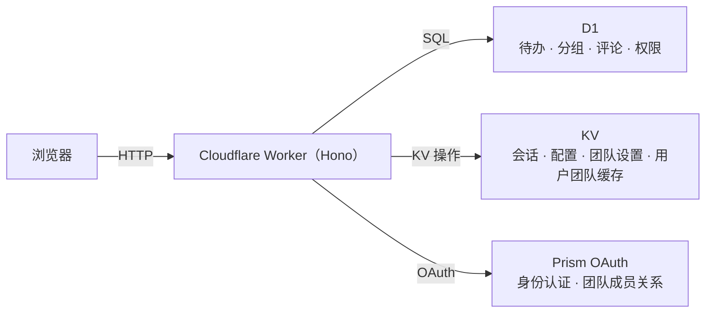

# 快速开始

Glint 是一款基于 Cloudflare Workers 构建的团队待办事项应用，使用 D1 持久化数据、KV 管理会话和配置，并以 Prism 作为 OAuth 身份提供方。整个技术栈运行在边缘节点——无需管理独立的后端服务器或数据库。

## 架构概览



Worker 从同一来源同时提供静态前端资源和 REST API，因此前后端之间无需配置 CORS。

---

## 前置条件

- **[Bun](https://bun.sh)** ≥ 1.0 — 包管理器和构建工具
- **[Wrangler CLI](https://developers.cloudflare.com/workers/wrangler/)** — Cloudflare Workers 部署工具
- 一个正在运行的 **[Prism](https://github.com/siiway/prism)** 实例用于身份认证

> Glint 不支持其他身份提供方，必须使用 Prism。

---

## 安装

```bash
git clone https://github.com/siiway/glint.git
cd glint
bun install
```

---

## Cloudflare 资源配置

### 1. 创建 D1 数据库

```bash
wrangler d1 create glint-db
```

输出中包含 `database_id`，将其复制到 `wrangler.jsonc`：

```jsonc
{
  "d1_databases": [
    {
      "binding": "DB",
      "database_name": "glint-db",
      "database_id": "YOUR_DATABASE_ID_HERE"
    }
  ]
}
```

### 2. 创建 KV 命名空间

```bash
wrangler kv namespace create KV
```

将输出的 `id` 复制到 `wrangler.jsonc`：

```jsonc
{
  "kv_namespaces": [
    {
      "binding": "KV",
      "id": "YOUR_KV_NAMESPACE_ID_HERE"
    }
  ]
}
```

本地开发还需添加 `preview_id`（通过 `wrangler kv namespace create KV --preview` 创建）。

### 3. Durable Object（实时同步）

无需手动创建。`TodoSync` Durable Object 已在 `wrangler.jsonc` 中声明，首次部署时会自动创建。本地开发（`bun run dev`）会在进程内模拟，无需额外操作。

::: tip
Durable Object 需要 Workers **付费计划**。在免费套餐下，待办事项操作仍正常工作，但实时 WebSocket 推送不可用。
:::

### 4. 应用数据库迁移

Glint 的数据库 schema 通过 `migrations/` 目录中的编号迁移文件管理。

```bash
# 本地开发
wrangler d1 migrations apply glint-db --local

# 生产环境
wrangler d1 migrations apply glint-db
```

迁移按顺序执行且幂等——重复执行是安全的。

### 5. 注册 Prism OAuth 应用

在 Prism 实例中创建一个新的 OAuth 应用，并配置以下内容：

| 字段         | 值                                                                    |
| ------------ | --------------------------------------------------------------------- |
| 重定向 URI   | `http://localhost:5173/callback`（开发）或 `https://your.domain/callback`（生产） |
| 权限范围     | `openid profile email teams:read`                                     |
| 客户端类型   | 公开（PKCE）**或** 机密（client secret）                              |

记下**客户端 ID**，使用机密客户端时还需记下**客户端密钥**，在初始化向导中填写。

#### PKCE 与机密客户端对比

| 模式     | 工作方式                                                         | 适用场景                    |
| -------- | ---------------------------------------------------------------- | --------------------------- |
| PKCE     | 前端生成随机 verifier，服务端通过 challenge 验证                  | 公开部署、单页应用           |
| 机密客户端 | 服务端在授权码交换时发送 `client_secret`，永不暴露给浏览器       | 私有部署、更高安全性要求     |

---

## 开发

启动本地开发服务器：

```bash
bun run dev
```

此命令同时启动 Vite 开发服务器（前端，端口 5173）和 Wrangler 本地 Worker。

首次访问 `http://localhost:5173` 时，Glint 会显示**初始化向导**：

1. **配置 Prism** — 输入 Base URL、Client ID、重定向 URI，以及可选的 client secret。
2. **访问控制** — 可选择输入允许的团队 ID，限制只有特定 Prism 团队的成员才能登录。
3. **初始化** — 创建所有数据库表并将配置保存到 KV。

配置完全存储在 KV 中——初始化后无需修改任何环境变量或文件。

### 本地 KV 持久化

Wrangler 的本地 KV 存储在 `.wrangler/state/v3/kv/` 目录下。如需重置本地状态（例如重新运行初始化向导），可删除相关文件或执行：

```bash
wrangler kv key delete --local --binding KV "init:configured"
```

---

## 部署

构建并部署到 Cloudflare：

```bash
bun run deploy
```

此命令先运行 `bun run build`（将前端编译到 `dist/`），然后执行 `wrangler deploy`（上传 Worker 和静态资源）。

部署后访问你的域名。若 Worker 是全新部署且 KV 为空，初始化向导将再次出现。

### 环境变量：`ALLOWED_TEAM_ID`

可在 `wrangler.jsonc` 或 Cloudflare 控制台中设置 `ALLOWED_TEAM_ID` 环境变量，将访问限制为特定 Prism 团队。此值会覆盖 KV 中存储的配置，且无法通过应用 UI 修改：

```jsonc
{
  "vars": {
    "ALLOWED_TEAM_ID": "your-prism-team-id"
  }
}
```

通过环境变量设置时，"设置 → 应用配置"页面会显示该值已被锁定的提示。

---

## 常见问题排查

### 登录后立即出现"会话已过期"

检查 Prism 应用中的重定向 URI 与 Glint 初始化向导中配置的是否完全一致，包括协议和路径。不匹配会导致授权码交换失败。

### 部署后初始化向导再次出现

初始化状态（`init:configured`）存储在 KV 中。若创建了新的 KV 命名空间或清空了 KV，向导会重新出现。重新初始化是安全的——它使用 `CREATE TABLE IF NOT EXISTS` 重建表并覆盖配置。

### 错误团队的用户可以登录

检查"设置 → 应用配置"中的 `allowed_team_id`，或设置 `ALLOWED_TEAM_ID` 环境变量以获得更严格的控制。团队成员关系在登录时评估，修改设置后需重新登录才会生效。

### 头像图片无法加载

头像由浏览器直接从 Prism 的 CDN 获取。若 Prism 部署在私有网络中，用户的浏览器可能无法访问头像。Glint 中没有头像代理——头像 URL 必须是公开可访问的。
