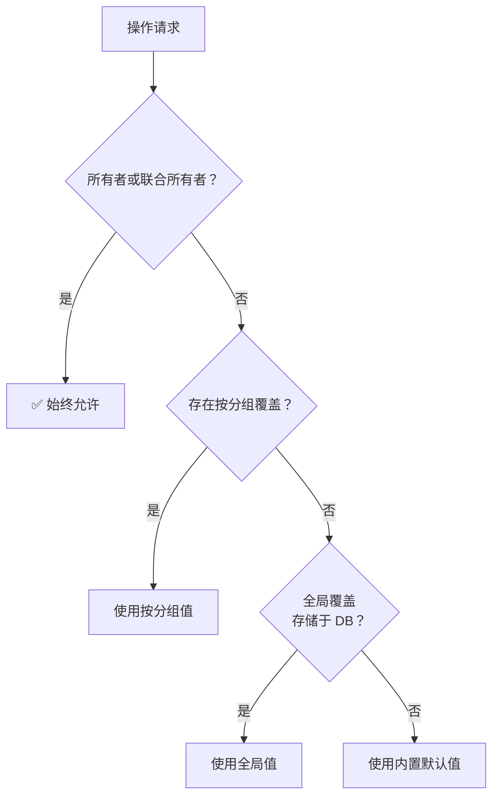

# 权限

Glint 拥有精细的、可配置的权限系统。团队所有者可以精确控制管理员和成员被允许执行的操作，粒度可细化到单个待办分组。

---

## 工作原理

- **所有者**和**联合所有者**始终拥有完全访问权限，此规则硬编码，不受权限配置影响。
- **管理员**和**成员**角色拥有可配置的权限，并有合理的内置默认值。
- 权限可在两个维度设置：
  - **全局**（团队范围）— 应用于所有待办分组
  - **按分组**（覆盖特定分组）— 仅对该分组生效，优先级高于全局设置

当某项操作被请求时，系统按以下顺序评估权限：



第一条匹配规则生效。按分组覆盖允许外科手术式的控制：收紧某一个分组，同时保留其他分组的默认设置；或为某个特定分组开放成员权限，而全局仍保持锁定状态。

---

## 解析顺序

| 优先级 | 来源 | 范围 |
| --- | --- | --- |
| 1（最高） | 硬编码 | 所有者 / 联合所有者：始终允许 |
| 2 | 按分组覆盖（D1） | 仅对被访问的特定分组生效 |
| 3 | 全局覆盖（D1） | 所有分组，除非被按分组覆盖 |
| 4（最低） | 内置默认值 | 无覆盖时的兜底 |

---

## 权限键说明

| 键 | 管理员默认 | 成员默认 | 说明 |
| --- | :---: | :---: | --- |
| `manage_settings` | 否 | 否 | 编辑站点名称、Logo、品牌设置和应用配置 |
| `manage_permissions` | 否 | 否 | 编辑权限规则（仅所有者可授予） |
| `manage_sets` | 是 | 否 | 创建、重命名、删除和重新排序待办分组 |
| `create_todos` | 是 | 是 | 创建新的待办事项 |
| `edit_own_todos` | 是 | 是 | 编辑本人创建的待办事项 |
| `edit_any_todo` | 是 | 否 | 编辑他人创建的待办事项 |
| `delete_own_todos` | 是 | 是 | 删除本人创建的待办事项 |
| `delete_any_todo` | 是 | 否 | 删除他人创建的待办事项 |
| `complete_any_todo` | 是 | 否 | 切换他人待办事项的完成状态 |
| `add_subtodos` | 是 | 是 | 创建嵌套的子待办事项 |
| `reorder_todos` | 是 | 否 | 拖拽重新排序待办事项 |
| `comment` | 是 | 是 | 对待办事项添加评论 |
| `delete_own_comments` | 是 | 是 | 删除本人发布的评论 |
| `delete_any_comment` | 是 | 否 | 删除他人发布的评论 |
| `view_todos` | 是 | 是 | 查看分组中的待办事项 |

---

## 管理权限

1. 前往**设置 → 权限**（需要 `manage_permissions` 权限或所有者角色）。
2. 从下拉菜单选择**范围**：
   - **全局**（团队范围）— 影响所有分组（除非被分组覆盖）
   - **特定分组** — 仅覆盖该分组的权限
3. 为每个角色（管理员 / 成员）切换各项权限的开关。
4. 点击**保存权限**。

使用**重置为默认值**可移除所选范围内的所有自定义覆盖，恢复内置默认设置（对于按分组范围，则回退到全局设置）。

---

## 按分组覆盖示例

### 限制敏感分组

你有一个名为"仅限HR"的分组，不希望成员查看。但全局配置允许成员查看所有分组：

| 范围 | 角色 | `view_todos` |
| --- | --- | :---: |
| 全局 | 成员 | ✓ |
| "仅限HR"分组 | 成员 | ✗ |

成员可以查看所有其他分组，但导航到"仅限HR"时会看到"未授权"提示，并被重定向回主页。

### 为成员开放特定分组的管理权限

希望成员能够在"待办事项池"分组中对待办事项排序，但在其他地方不行：

| 范围 | 角色 | `reorder_todos` |
| --- | --- | :---: |
| 全局 | 成员 | ✗ |
| "待办事项池"分组 | 成员 | ✓ |

成员仅可在"待办事项池"中拖拽排序，其他分组不受影响。

---

## 重要约束

::: warning
只有**所有者**（而非联合所有者或管理员）才能将 `manage_permissions` 权限授予管理员。这防止权限提升——管理员无法自行获取超出所有者授权的权限。
:::

::: tip
`view_todos` 权限被撤销后，用户在切换到该分组时将收到"未授权"提示，并被重定向回主页。分组仍然显示在侧边栏中，但点击时会阻止访问。
:::

::: info
所有者和联合所有者的权限不会受任何权限规则影响。即使全局将管理员的 `manage_settings` 设为 `false`，所有者也不受此限制。
:::

---

## 查看有效权限

要查看当前用户的解析后权限（综合角色、全局覆盖、按分组覆盖）：

```
GET /api/teams/:teamId/permissions/me?setId=<set-uuid>
```

这将返回每个权限键的实际 `true`/`false` 值，这正是前端用于显示或隐藏 UI 元素的数据。详见[权限 API](../api/permissions)。
