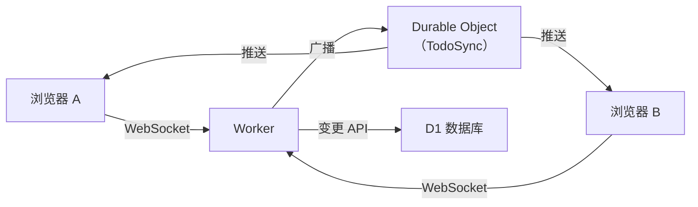

# 实时同步

Glint 使用 WebSocket 将待办事项变更即时推送给所有已连接的用户。当一名用户创建、编辑、完成、重新排序或认领一个待办事项时，所有正在查看同一分组的其他用户无需刷新页面即可看到更新。

---

## 工作原理



每个团队对应一个独立的 **`TodoSync` Durable Object** 实例，以团队 ID 命名。当浏览器打开某个待办分组时，会向 `/api/teams/:teamId/sets/:setId/ws` 建立 WebSocket 连接。Worker 对请求进行身份验证，然后将升级请求转发给 Durable Object，并用分组 ID 标记该 Socket。

当一次变更操作完成（创建、更新、删除、重排序、认领）后，Worker 会向同一个 Durable Object 异步广播事件。DO 查找所有带有该分组 ID 标记的 Socket，并向每个 Socket 发送事件 JSON。广播是"即发即忘"的——不会阻塞变更操作的响应。

---

## 事件类型

| 事件 | 载荷 |
| --- | --- |
| `todo:created` | 完整的待办事项对象 |
| `todo:updated` | `{ id, ...已变更字段 }` — 部分更新 |
| `todo:deleted` | `{ id }` |
| `todo:reordered` | `{ items: [{ id, sortOrder }] }` |
| `todo:claimed` | `{ id, claimedBy, claimedByName, claimedByAvatar }` |

所有事件均包含 `setId`，以便客户端在连接范围过宽时忽略来自其他分组的事件。

---

## 客户端行为

`useRealtimeSync` Hook 管理连接生命周期：

- 当用户选择了一个分组且已通过身份验证时，自动建立连接。
- 在 `auto`（默认）模式下，会先尝试 WebSocket，首次失败后自动回退到 SSE。
- **自动重连**：连接断开后使用指数退避策略重试：500 ms → 1 s → 2 s → … → 最大 30 s。
- 所有接收到的事件以**幂等方式**应用到本地状态——`todo:created` 在追加前先检查重复项，确保用户自己的操作（同样会乐观更新本地状态）不会出现两次。
- 组件卸载或选中的分组切换时，连接会被干净地关闭。
- 看到 `101 Switching Protocols` 后暂时没有后续帧是正常的（空闲态）；只有发生变更时才会推送事件。服务端在 WS 建连后也会发送一条初始 `realtime:ready` 消息用于确认链路可用。

---

## 配置与部署

无需手动创建额外的 Cloudflare 资源。Durable Object 类（`TodoSync`）在 `wrangler.jsonc` 中与迁移标签一起声明：

```jsonc
{
  "durable_objects": {
    "bindings": [
      { "name": "TODO_SYNC", "class_name": "TodoSync" }
    ]
  },
  "migrations": [
    { "tag": "v1", "new_classes": ["TodoSync"] }
  ]
}
```

首次执行 `wrangler deploy` 时，Cloudflare 会自动创建 Durable Object 命名空间。本地开发（`bun run dev`）也同样支持——Wrangler 会在进程内模拟 Durable Object，无需额外配置。

::: tip
Durable Object 需要 Workers **付费计划**或更高等级。免费套餐不支持 Durable Object。如果你在免费套餐上评估 Glint，实时同步将静默失败——待办事项的增删改操作仍通过普通 HTTP 正常工作，只是实时推送不可用。
:::

---

## WebSocket 端点

```
GET /api/teams/:teamId/sets/:setId/ws
Upgrade: websocket
```

需要有效的会话（与所有其他 API 路由使用相同的 Cookie）。若用户不是该团队的成员，返回 `403`。若请求不是 WebSocket 升级请求，返回 `426`。

该端点由 `worker/routes/ws.ts` 处理，并代理至 `worker/durable-objects/todo-sync.ts` 中的 `TodoSync` Durable Object。
